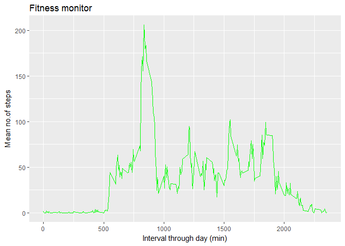

# Reproducible Research: Peer Assessment 1
SatyaBharat  


## Activity Monitor Data Assignment


```r
library(knitr, quiet=T)
library(plyr, quiet=T)  
```

```
## Warning: package 'plyr' was built under R version 3.4.1
```

```r
library(ggplot2, quiet=T) 
```

```
## Warning: package 'ggplot2' was built under R version 3.4.1
```

```r
opts_chunk$set(dev="png", fig.path="figure/")
```

## Loading and preprocessing the data


## What is mean total number of steps taken per day?

<!-- -->

```
## The mean number of steps per day is 9354 and the median is 10395 (ignoring missing values
```


## What is the average daily activity pattern?

<!-- -->


## Imputing missing values


```
## Number of rows with missing data: 2304
```

```
## For the raw data the mean and median per day are: 9354.23 and 10395
```

```
## For the imputed the mean and median per day are: 10766.19 and 10766.19
```

<!-- -->


## Are there differences in activity patterns between weekdays and weekends?

<!-- -->


