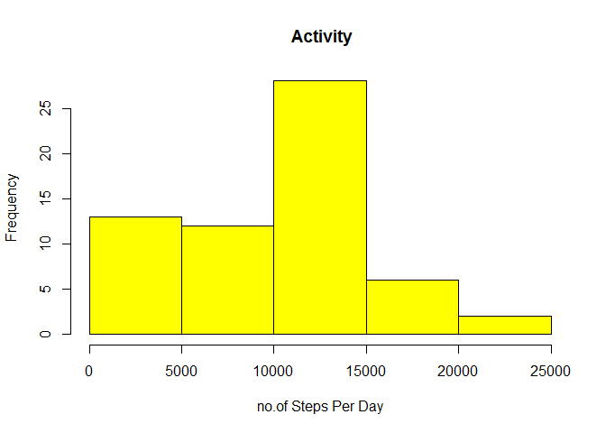

# Reproducible Research: Peer Assessment 1


## Activity Monitor Data Assignment


```
## Warning: package 'plyr' was built under R version 3.4.1
```

```
## Warning: package 'ggplot2' was built under R version 3.4.1
```

## Loading and preprocessing the data


## What is mean total number of steps taken per day?


```r
monitor.daily <- ddply(monitor, .(date.factor), summarize,
                        total.steps=sum(steps, na.rm=TRUE))
hist(monitor.daily$total.steps, col="blue", main=" Activity",
     xlab="no.of Steps Per Day")
```

<!-- -->

```r
pdaymean <- mean(monitor.daily$total.steps, na.rm=TRUE)
pdaymedian <- median(monitor.daily$total.steps, na.rm=TRUE)
cat(paste("The mean number of steps per day is", 
          format(pdaymean, digits=4), "and the median is", 
          format(pdaymedian, digits=2), "(ignoring missing values"))
```

```
## The mean number of steps per day is 9354 and the median is 10395 (ignoring missing values
```


## What is the average daily activity pattern?


```r
monitor.pattern <- ddply(monitor, "interval", summarize,
                          mean=mean(steps, na.rm=TRUE))
g <- ggplot(monitor.pattern, aes(interval, mean))
g + geom_line(color="blue") + 
  labs(title="Fitness monitor", 
       x="Interval through day (min)",
       y="Mean no.of steps")
```

<!-- -->


## Imputing missing values


```
## Number of rows with missing data: 2304
```

```
## For the raw data the mean and median per day are: 9354.23 and 10395
```

```
## For the imputed the mean and median per day are: 10766.19 and 10766.19
```

<!-- -->


## Are there differences in activity patterns between weekdays and weekends?


